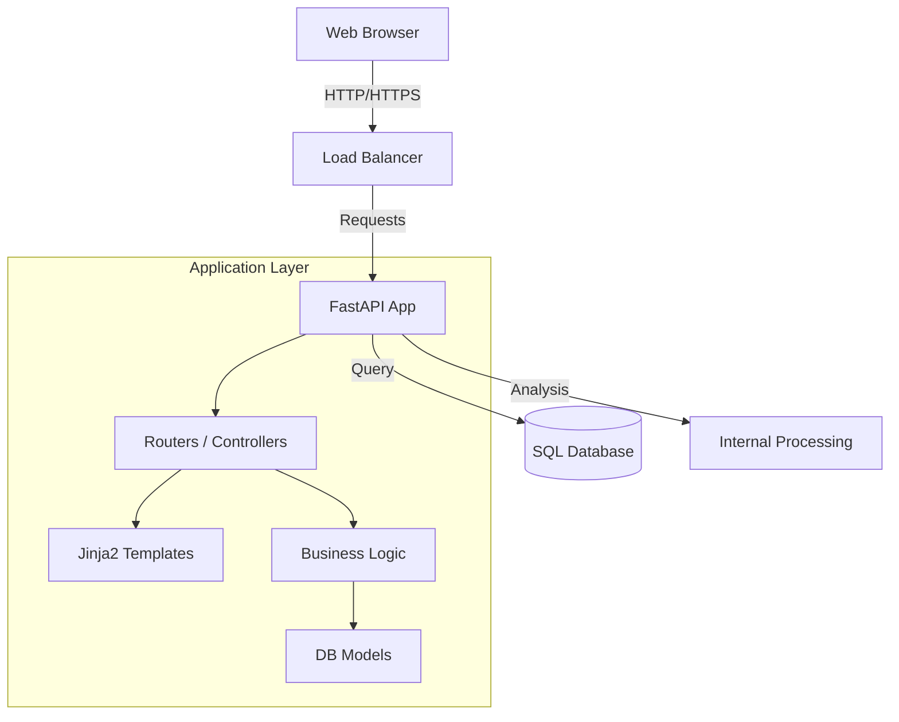
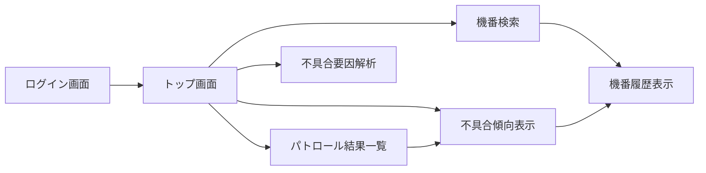

# 3. 設計仕様書 (Design Specification)

## 3.1 アーキテクチャ構成
Monaは、Python (FastAPI) を中心としたサーバーサイドレンダリング（SSR）に近いハイブリッド構成を採用する。データ可視化にはクライアントサイドのEChartsを使用する。

## 3.2 データベース設計 (Schema)

### users (ユーザー)
| Column | Type | Description |
|---|---|---|
| id | Integer | PK |
| username | String | ログインID (Unique) |
| hashed_password | String | bcryptハッシュ済PW |
| is_active | Boolean | 有効フラグ |

### machines (機体情報)
| Column | Type | Description |
|---|---|---|
| id | Integer | PK |
| machine_number | String | 機番 (Unique) |
| model_series | String | シリーズ名 (A, B, C...) |
| model_number | String | モデル型番 |
| manufacture_month | Date | 製造月 |

### events (イベント履歴)
| Column | Type | Description |
|---|---|---|
| id | Integer | PK |
| machine_id | Integer | FK (machines.id) |
| event_date | Date | 発生日 |
| event_type | String | '不具合発生', 'FW更新' 等 |
| event_category | String | 不具合分類など |
| event_code | String | エラーコード |

### patrol_results (パトロール結果)
| Column | Type | Description |
|---|---|---|
| id | Integer | PK |
| patrol_date | Date | パトロール実施日（対象データ日） |
| machine_id | String | 機番文字列（DB結合用ではない緩い参照） |
| rank | String | 判定ランク (A/B/C) |
| defect_description | String | 検出内容 |
| alert_flag | Boolean | アラート有無 |

### characteristic_values (特性値)
| Column | Type | Description |
|---|---|---|
| id | Integer | PK |
| machine_id | Integer | FK (machines.id) |
| record_date | Date | 記録日 |
| category | String | センサーカテゴリ (Temperature, Pressure...) |
| characteristic_id | String | 特性ID (Temp_Zone1...) |
| value_numeric | Float | 数値 |

## 3.3 解析ロジック詳細
不具合データ数（$N$）に応じて以下のモードを切り替える。詳細は `analysis_spec_details.md` を参照。

1.  **Exploration Mode ($N < 30$):**
    *   Cliff's Delta, Mann-Whitney U検定
2.  **Quasi-Stat Mode ($30 \le N < 100$):**
    *   Point Biserial Correlation
3.  **Standard Mode ($100 \le N < 300$):**
    *   L1 Regularized Logistic Regression (Lasso)
4.  **AI Analysis Mode ($N \ge 300$):**
    *   LightGBM + SHAP

## 3.4 画面遷移図

