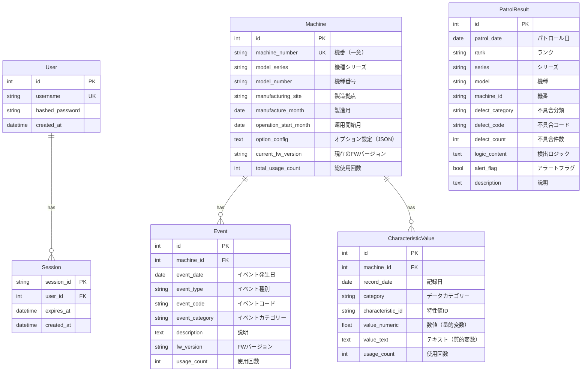
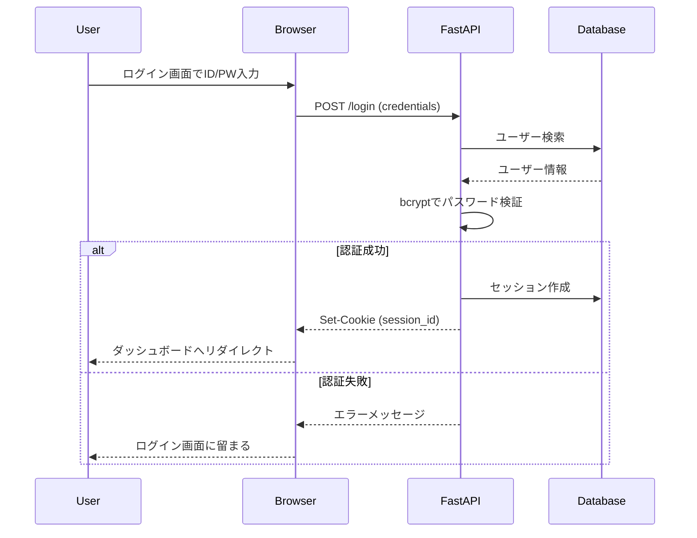

# Mona 詳細仕様書

> **目的**: この仕様書は、Monaアプリケーションを0から復元できるレベルの詳細な実装仕様を記載しています。
> 
> **対象読者**: 開発者、システム設計者、運用担当者

---

## 目次

1. [プロジェクト概要](#プロジェクト概要)
2. [システムアーキテクチャ](#システムアーキテクチャ)
3. [技術スタック](#技術スタック)
4. [環境構築](#環境構築)
5. [データベース設計](#データベース設計)
6. [バックエンド実装](#バックエンド実装)
7. [フロントエンド実装](#フロントエンド実装)
8. [認証・認可](#認証認可)
9. [機能詳細仕様](#機能詳細仕様)
10. [URL設計](#url設計)
11. [API仕様](#api仕様)
12. [UI/UX仕様](#uiux仕様)
13. [デプロイ・運用](#デプロイ運用)

---

## プロジェクト概要

**Mona（Mona Machine Visualization）**は、機器データを可視化し、設計エンジニアが不具合解析および特性値監視を行うためのWebアプリケーションです。

### 主な目的

1. **不具合監視**: パトロール結果から不具合傾向を可視化し、早期発見・対応を支援
2. **特性値監視**: 機器の特性値を時系列やクロスセクションで分析
3. **機番追跡**: 個別機器の履歴を追跡し、イベントと特性値の相関を分析
4. **統計分析**: 製造月、機種、不具合分類などの軸でデータを集計・可視化

### アプリケーション名の由来

**Mona**は「猫」をモチーフにしており、ブランドロゴには猫のアイコンが使用されています。

---

## システムアーキテクチャ

### 全体構成

```
┌──────────────┐
│   Browser    │  ← ユーザーインターフェース（HTML + JS + ECharts）
└──────┬───────┘
       │ HTTP / REST API
┌──────▼───────┐
│   FastAPI    │  ← アプリケーションサーバー（Python）
│   Uvicorn    │
└──────┬───────┘
       │ SQLAlchemy 2.0（async）
┌──────▼───────┐
│  Database    │  ← SQLite / PostgreSQL / SQL Server
│   Storage    │
└──────────────┘
```

### レイヤー構成

#### 1. プレゼンテーション層（Frontend）
- **テンプレート**: Jinja2による動的HTMLレンダリング
- **JavaScript**: バニラJS（フレームワーク不使用）
- **グラフ描画**: ECharts 5.x + プラグイン（annotation, boxplot）
- **アイコン**: Lucide Icons（CDN）
- **スタイリング**: Vanilla CSS（カスタムプロパティ利用）

#### 2. アプリケーション層（Backend）
- **Webフレームワーク**: FastAPI 0.100+
- **ルーター**: 機能別モジュール分割（`app/routers/*.py`）
- **サービス層**: ビジネスロジック（`app/services/*.py`）
  - `crud.py`: データベース操作
  - `dummy_data.py`: テスト用ダミーデータ生成
  - `dataset_builder.py`: データセット構築
  - `analysis_logic.py`: 分析ロジック

#### 3. データ層（Database）
- **ORM**: SQLAlchemy 2.0（asyncio対応）
- **マイグレーション**: Alembic
- **対応DB**: SQLite（開発）、PostgreSQL（本番想定）、SQL Server（オプション）

---

## 技術スタック

### バックエンド

| カテゴリ | 技術 | バージョン | 用途 |
|---------|------|-----------|------|
| 言語 | Python | 3.11+ | メイン開発言語 |
| Webフレームワーク | FastAPI | 0.100+ | API・ルーティング |
| ASGIサーバー | Uvicorn | 0.23+ | アプリケーション実行 |
| ORM | SQLAlchemy | 2.0+ | データベースアクセス |
| マイグレーション | Alembic | 1.11+ | スキーマ管理 |
| テンプレート | Jinja2 | 3.1+ | HTMLレンダリング |
| 認証 | bcrypt | 4.0+ | パスワードハッシュ化 |
| 環境変数 | python-dotenv | 1.0+ | 設定管理 |
| パッケージ管理 | uv | 最新 | 依存関係管理 |

### フロントエンド

| カテゴリ | 技術 | バージョン | 用途 |
|---------|------|-----------|------|
| 描画ライブラリ | ECharts | 5.5.0 | チャート描画 |
| EChartsプラグイン | echarts-simple-transform | 1.0.0 | データ変換 |
| EChartsプラグイン | echarts-extension-gmap | 該当なし | - |
| アイコン | Lucide Icons | 最新（CDN） | UIアイコン |
| スタイリング | Vanilla CSS | - | デザイン実装 |

### データベース

| カテゴリ | 技術 | バージョン | 用途 |
|---------|------|-----------|------|
| 開発DB | SQLite | 3.x | ローカル開発 |
| 本番DB | PostgreSQL | 14+ | 本番環境想定 |
| オプション | SQL Server | 2019+ | 企業環境向けオプション |

### 開発ツール

| カテゴリ | 技術 | 用途 |
|---------|------|------|
| Version Control | Git | ソース管理 |
| IDE | VS Code（推奨） | 開発環境 |
| APIテスト | curl / Postman | API動作確認 |

---

## 環境構築

### 前提条件

- Python 3.11以上
- uv パッケージマネージャー
- Git

### セットアップ手順

#### 1. リポジトリクローン

```bash
git clone <repository-url>
cd machine-viz2
```

#### 2. 仮想環境と依存関係のインストール

```bash
# uvを使用して依存関係をインストール
uv sync
```

#### 3. 環境変数設定

`.env`ファイルを作成：

```bash
cp .env.example .env
```

`.env`ファイルの内容：

```bash
# アプリケーション設定
APP_ENV=development          # development / staging / production
APP_DEBUG=true
APP_HOST=127.0.0.1
APP_PORT=8000

# データベース設定
DATABASE_URL=sqlite+aiosqlite:///./machine_viz.db

# データソース設定
USE_DUMMY_DATA=false         # true=ダミーデータ, false=実データベース

# セキュリティ
SECRET_KEY=your-secret-key-here  # 本番環境では必ず変更
LOG_LEVEL=DEBUG
```

#### 4. データベース初期化

```bash
# Alembicマイグレーション実行
alembic upgrade head

# ダミーデータシード（オプション）
PYTHONPATH=. uv run python seed_db.py
```

#### 5. 管理者ユーザー作成

```bash
PYTHONPATH=. uv run python scripts/create_admin.py <username> <password>
```

#### 6. アプリケーション起動

```bash
uv run uvicorn app.main:app --reload
```

ブラウザで `http://localhost:8000` にアクセス。

---

## データベース設計

### ERダイアグラム



### テーブル定義

#### users

**用途**: ユーザーアカウント情報

| カラム名 | 型 | NULL | デフォルト | 説明 |
|---------|-----|------|-----------|------|
| id | INTEGER | NO | AUTO | 主キー |
| username | VARCHAR(50) | NO | - | ユーザー名（一意） |
| hashed_password | VARCHAR(255) | NO | - | bcryptハッシュ化パスワード |
| created_at | DATETIME | NO | CURRENT_TIMESTAMP | 作成日時 |

**インデックス**:
- PRIMARY KEY: `id`
- UNIQUE: `username`

---

#### sessions

**用途**: セッション情報（Cookie認証）

| カラム名 | 型 | NULL | デフォルト | 説明 |
|---------|-----|------|-----------|------|
| session_id | VARCHAR(255) | NO | - | セッションID（主キー） |
| user_id | INTEGER | NO | - | ユーザーID（外部キー） |
| expires_at | DATETIME | NO | - | 有効期限 |
| created_at | DATETIME | NO | CURRENT_TIMESTAMP | 作成日時 |

**インデックス**:
- PRIMARY KEY: `session_id`
- INDEX: `user_id`
- INDEX: `expires_at`

---

#### machines

**用途**: 機番属性（機器のマスターデータ）

| カラム名 | 型 | NULL | デフォルト | 説明 |
|---------|-----|------|-----------|------|
| id | INTEGER | NO | AUTO | 主キー |
| machine_number | VARCHAR(50) | NO | - | 機番（一意） |
| model_series | VARCHAR(50) | NO | - | 機種シリーズ（例: X1000） |
| model_number | VARCHAR(50) | NO | - | 機種番号（例: A, B, C） |
| manufacturing_site | VARCHAR(50) | YES | NULL | 製造拠点（例: 東京工場） |
| manufacture_month | DATE | NO | - | 製造月 |
| operation_start_month | DATE | YES | NULL | 運用開始月 |
| option_config | TEXT | YES | NULL | オプション設定（JSON形式） |
| current_fw_version | VARCHAR(50) | YES | NULL | 現在のFWバージョン |
| total_usage_count | INTEGER | NO | 0 | 総使用回数 |

**インデックス**:
- PRIMARY KEY: `id`
- UNIQUE INDEX: `machine_number`
- INDEX: `model_series`
- INDEX: `model_number`
- INDEX: `manufacturing_site`

---

#### events

**用途**: イベント情報（FW更新、部品交換、メンテナンス、不具合発生）

| カラム名 | 型 | NULL | デフォルト | 説明 |
|---------|-----|------|-----------|------|
| id | INTEGER | NO | AUTO | 主キー |
| machine_id | INTEGER | NO | - | 機番ID（外部キー） |
| event_date | DATE | NO | - | イベント発生日 |
| event_type | VARCHAR(50) | NO | - | イベント種別（FW更新/部品交換/メンテナンス/不具合発生） |
| event_code | VARCHAR(50) | YES | NULL | イベントコード |
| event_category | VARCHAR(100) | YES | NULL | イベントカテゴリー |
| description | TEXT | YES | NULL | 説明 |
| fw_version | VARCHAR(50) | YES | NULL | FWバージョン |
| usage_count | INTEGER | YES | NULL | イベント発生時の使用回数 |

**インデックス**:
- PRIMARY KEY: `id`
- INDEX: `machine_id`
- INDEX: `event_date`
- INDEX: `event_type`

**外部キー**:
- `machine_id` → `machines.id` (CASCADE DELETE)

---

#### characteristic_values

**用途**: 特性値（機器の計測データ）

| カラム名 | 型 | NULL | デフォルト | 説明 |
|---------|-----|------|-----------|------|
| id | INTEGER | NO | AUTO | 主キー |
| machine_id | INTEGER | NO | - | 機番ID（外部キー） |
| record_date | DATE | NO | - | 記録日 |
| category | VARCHAR(100) | NO | - | データカテゴリー（例: 温度、振動） |
| characteristic_id | VARCHAR(100) | NO | - | 特性値ID（例: temp_sensor_1） |
| value_numeric | FLOAT | YES | NULL | 数値（量的変数） |
| value_text | TEXT | YES | NULL | テキスト（質的変数） |
| usage_count | INTEGER | YES | NULL | 記録時点の使用回数 |

**インデックス**:
- PRIMARY KEY: `id`
- INDEX: `machine_id`
- INDEX: `record_date`
- INDEX: `category`
- INDEX: `characteristic_id`

**外部キー**:
- `machine_id` → `machines.id` (CASCADE DELETE)

**備考**:
- `value_numeric`と`value_text`は排他的ではない（両方存在してもよい）
- `value_numeric`が存在する場合は量的変数、`value_text`のみの場合は質的変数として扱う

---

#### patrol_results

**用途**: パトロール結果（監視ロジックによる自動検出結果）

| カラム名 | 型 | NULL | デフォルト | 説明 |
|---------|-----|------|-----------|------|
| id | INTEGER | NO | AUTO | 主キー |
| patrol_date | DATE | NO | - | パトロール実施日 |
| rank | VARCHAR(10) | NO | - | ランク（A, B, C） |
| series | VARCHAR(50) | NO | - | シリーズ |
| model | VARCHAR(50) | NO | - | 機種 |
| machine_id | VARCHAR(50) | NO | - | 機番 |
| defect_category | VARCHAR(100) | NO | - | 不具合分類 |
| defect_code | VARCHAR(50) | NO | - | 不具合コード |
| defect_count | INTEGER | NO | 0 | 不具合件数 |
| logic_content | TEXT | NO | - | 検出ロジック内容 |
| alert_flag | BOOLEAN | NO | FALSE | アラートフラグ |
| description | TEXT | YES | NULL | 説明 |

**インデックス**:
- PRIMARY KEY: `id`
- INDEX: `patrol_date`
- INDEX: `rank`
- INDEX: `series`
- INDEX: `model`
- INDEX: `machine_id`
- INDEX: `defect_category`
- INDEX: `defect_code`

---

### データベースマイグレーション

Alembicを使用してスキーマ管理を行います。

#### マイグレーション作成

```bash
alembic revision --autogenerate -m "説明"
```

#### マイグレーション適用

```bash
alembic upgrade head
```

#### ロールバック

```bash
alembic downgrade -1
```

---

## バックエンド実装

### ディレクトリ構成

```
app/
├── __init__.py
├── main.py                    # FastAPIアプリケーションエントリーポイント
├── config.py                  # 設定管理
├── database.py                # データベース接続設定
├── core/
│   └── security.py            # 認証・セキュリティ
├── models/                    # SQLAlchemyモデル
│   ├── __init__.py
│   ├── user.py                # ユーザーモデル
│   ├── machine.py             # 機番属性モデル
│   ├── event.py               # イベント情報モデル
│   ├── characteristic.py      # 特性値モデル
│   └── patrol.py              # パトロール結果モデル
├── routers/                   # APIルーター
│   ├── __init__.py
│   ├── auth.py                # 認証API
│   ├── defect_trend.py        # 不具合傾向API
│   ├── history.py             # 機番履歴API
│   ├── cross_section.py       # 断面データAPI
│   ├── patrol_result.py       # パトロール結果API
│   ├── search.py              # 機番検索API
│   ├── data_catalog.py        # データカタログAPI
│   └── analysis.py            # 要因解析API
├── services/                  # サービス層（ビジネスロジック）
│   ├── __init__.py
│   ├── crud.py                # CRUD操作
│   ├── dummy_data.py          # ダミーデータ生成
│   ├── dataset_builder.py    # データセット構築
│   └── analysis_logic.py      # 分析ロジック
├── static/                    # 静的ファイル
│   ├── css/
│   │   └── style.css
│   ├── js/
│   │   ├── common.js
│   │   ├── defect_trend.js
│   │   ├── history.js
│   │   ├── cross_section.js
│   │   ├── patrol_result.js
│   │   ├── search.js
│   │   └── analysis.js
│   └── favicon.ico
└── templates/                 # Jinja2テンプレート
    ├── base.html              # ベーステンプレート
    ├── index.html             # トップページ
    ├── login.html             # ログインページ
    ├── defect_trend.html      # 不具合傾向表示
    ├── history.html           # 機番履歴表示
    ├── cross_section.html     # 断面データ表示
    ├── patrol_result.html     # パトロール結果一覧
    ├── search.html            # 機番検索
    ├── data_catalog.html      # データカタログ
    └── analysis.html          # 要因解析
```

### 設定管理（config.py）

```python
"""アプリケーション設定"""
import os
from functools import lru_cache
from dotenv import load_dotenv

load_dotenv()

class Settings:
    """アプリケーション設定クラス"""
    
    # アプリケーション設定
    APP_ENV: str = os.getenv("APP_ENV", "development")
    APP_DEBUG: bool = os.getenv("APP_DEBUG", "true").lower() == "true"
    APP_HOST: str = os.getenv("APP_HOST", "127.0.0.1")
    APP_PORT: int = int(os.getenv("APP_PORT", "8000"))
    
    # データベース設定
    DATABASE_URL: str = os.getenv("DATABASE_URL", "sqlite+aiosqlite:///./machine_viz.db")
    
    # データソース設定
    USE_DUMMY_DATA: bool = os.getenv("USE_DUMMY_DATA", "true").lower() == "true"
    
    # セキュリティ
    SECRET_KEY: str = os.getenv("SECRET_KEY", "dev-secret-key")
    LOG_LEVEL: str = os.getenv("LOG_LEVEL", "DEBUG")
    
    @property
    def is_development(self) -> bool:
        return self.APP_ENV == "development"
    
    @property
    def is_production(self) -> bool:
        return self.APP_ENV == "production"

@lru_cache()
def get_settings() -> Settings:
    """設定のシングルトンインスタンスを取得"""
    return Settings()
```

### データベース接続（database.py）

```python
"""データベース接続設定"""
from sqlalchemy.ext.asyncio import create_async_engine, AsyncSession
from sqlalchemy.orm import sessionmaker, declarative_base
from app.config import get_settings

settings = get_settings()

# 非同期エンジン作成
engine = create_async_engine(
    settings.DATABASE_URL,
    echo=settings.APP_DEBUG,
    future=True,
)

# セッションファクトリー
async_session = sessionmaker(
    engine, class_=AsyncSession, expire_on_commit=False
)

# ベースクラス
Base = declarative_base()

async def init_db():
    """データベース初期化"""
    async with engine.begin() as conn:
        await conn.run_sync(Base.metadata.create_all)

async def get_db() -> AsyncSession:
    """DB セッション依存性"""
    async with async_session() as session:
        yield session
```

### メインアプリケーション（main.py）

主要コンポーネント:

1. **ライフサイクル管理**: `@asynccontextmanager`でDB初期化
2. **ルーター登録**: 機能別ルーターを登録
3. **認証保護**: `Depends(get_current_user)`で保護
4. **エラーハンドリング**: 401エラー時にログインページへリダイレクト

```python
"""FastAPI アプリケーション"""
from contextlib import asynccontextmanager
from fastapi import FastAPI, Request, Depends, HTTPException, status
from fastapi.responses import HTMLResponse, JSONResponse, RedirectResponse
from fastapi.staticfiles import StaticFiles
from fastapi.templating import Jinja2Templates
from sqlalchemy.ext.asyncio import AsyncSession

from app.config import get_settings
from app.database import init_db, get_db
from app.routers import (
    history, search, defect_trend, patrol_result,
    data_catalog, auth, cross_section, analysis
)
from app.routers.auth import get_current_user

settings = get_settings()
templates = Jinja2Templates(directory="app/templates")

@asynccontextmanager
async def lifespan(app: FastAPI):
    """アプリケーションライフサイクル"""
    # 起動時
    if not settings.USE_DUMMY_DATA:
        await init_db()
    yield
    # 終了時

app = FastAPI(
    title="機器情報可視化",
    description="機器データを可視化するWebアプリケーション",
    version="0.1.0",
    lifespan=lifespan,
)

# 静的ファイル
app.mount("/static", StaticFiles(directory="app/static"), name="static")

# ルーター登録
app.include_router(auth.router)

# 認証が必要なルーター
protected_routers = [
    history.router,
    search.router,
    defect_trend.router,
    patrol_result.router,
    data_catalog.router,
    cross_section.router,
    analysis.router
]

for router in protected_routers:
    app.include_router(router, dependencies=[Depends(get_current_user)])

@app.exception_handler(HTTPException)
async def auth_exception_handler(request: Request, exc: HTTPException):
    """認証エラー時のハンドラ（ログイン画面へリダイレクト）"""
    if exc.status_code == status.HTTP_401_UNAUTHORIZED:
        # APIリクエストの場合はJSONを返す
        if request.url.path.startswith("/api/") or "/api/" in request.url.path:
             return JSONResponse(status_code=401, content={"detail": "Not authenticated"})
        
        return RedirectResponse(url="/login")
    return await http_exception_handler(request, exc)

@app.get("/", response_class=HTMLResponse, dependencies=[Depends(get_current_user)])
async def root(request: Request, db: AsyncSession = Depends(get_db)):
    """トップページ表示"""
    stats = {
        "last_updated": "-",
        "recent_alerts": 0
    }
    
    if not settings.USE_DUMMY_DATA:
        from app.services import crud
        try:
            db_stats = await crud.get_dashboard_stats(db)
            stats.update(db_stats)
        except Exception as e:
            print(f"Error loading dashboard stats: {e}")
    else:
        # ダミーデータ
        from datetime import date, timedelta
        stats["last_updated"] = date.today().isoformat()
        stats["recent_alerts"] = 5
        stats["alert_start_date"] = (date.today() - timedelta(days=7)).isoformat()
        stats["alert_end_date"] = date.today().isoformat()
        
    return templates.TemplateResponse(
        "index.html",
        {
            "request": request,
            "stats": stats
        }
    )
```

---

## フロントエンド実装

### 共通UI/UX設計

#### トースト通知システム

- **位置**: 画面上部中央（Top-Center）
- **種類**: Success（成功）、Info（情報）、Warning（警告）、Error（エラー）
- **特徴**: 
  - 操作を阻害しない非モーダル通知
  - `alert()`ダイアログの代替
  - 自動的に消える（3〜5秒後）

**実装（common.js）**:

```javascript
// トースト通知を表示
function showToast(message, type = 'info') {
    const toast = document.createElement('div');
    toast.className = `toast toast-${type}`;
    toast.textContent = message;
    
    document.body.appendChild(toast);
    
    setTimeout(() => {
        toast.classList.add('show');
    }, 100);
    
    setTimeout(() => {
        toast.classList.remove('show');
        setTimeout(() => toast.remove(), 300);
    }, 3000);
}
```

#### ローディング表示

- **位置**: コンテンツエリア中央
- **表示タイミング**: API通信中
- **実装**: スピナーアイコン + "読み込み中..." テキスト

```javascript
function showLoading(containerId) {
    const container = document.getElementById(containerId);
    container.innerHTML = '<div class="loading"><i data-lucide="loader-2"></i> 読み込み中...</div>';
    lucide.createIcons();
}

function hideLoading(containerId) {
    const container = document.getElementById(containerId);
    container.innerHTML = '';
}
```

### CSS設計

**ファイル**: `app/static/css/style.css`

#### CSSカスタムプロパティ（デザイントークン）

```css
:root {
    /* カラーパレット */
    --primary-color: #4A90E2;
    --secondary-color: #F5A623;
    --success-color: #7ED321;
    --danger-color: #D0021B;
    --warning-color: #F8E71C;
    --info-color: #50E3C2;
    
    /* グレースケール */
    --gray-50: #F9FAFB;
    --gray-100: #F3F4F6;
    --gray-200: #E5E7EB;
    --gray-300: #D1D5DB;
    --gray-700: #374151;
    --gray-900: #111827;
    
    /* スペーシング */
    --spacing-xs: 0.25rem;
    --spacing-sm: 0.5rem;
    --spacing-md: 1rem;
    --spacing-lg: 1.5rem;
    --spacing-xl: 2rem;
    
    /* フォント */
    --font-family: -apple-system, BlinkMacSystemFont, "Segoe UI", Roboto, sans-serif;
    --font-size-sm: 0.875rem;
    --font-size-base: 1rem;
    --font-size-lg: 1.125rem;
    --font-size-xl: 1.25rem;
    
    /* ボーダー半径 */
    --radius-sm: 0.25rem;
    --radius-md: 0.5rem;
    --radius-lg: 0.75rem;
    
    /* シャドウ */
    --shadow-sm: 0 1px 2px 0 rgba(0, 0, 0, 0.05);
    --shadow-md: 0 4px 6px -1px rgba(0, 0, 0, 0.1);
    --shadow-lg: 0 10px 15px -3px rgba(0, 0, 0, 0.1);
}
```

#### レイアウトクラス

```css
/* コンテナ */
.container {
    max-width: 1400px;
    margin: 0 auto;
    padding: var(--spacing-lg);
}

/* グリッド */
.grid {
    display: grid;
    gap: var(--spacing-md);
}

.grid-2 {
    grid-template-columns: repeat(2, 1fr);
}

.grid-3 {
    grid-template-columns: repeat(3, 1fr);
}

/* フレックス */
.flex {
    display: flex;
    gap: var(--spacing-md);
}

.flex-center {
    align-items: center;
    justify-content: center;
}

.flex-between {
    align-items: center;
    justify-content: space-between;
}
```

### EChartsチャート実装

#### 基本設定

全チャートに共通するデフォルト設定:

```javascript
const defaultChartOptions = {
    grid: {
        left: '3%',
        right: '4%',
        bottom: '3%',
        containLabel: true
    },
    tooltip: {
        trigger: 'axis',
        axisPointer: {
            type: 'cross'
        }
    },
    toolbox: {
        feature: {
            saveAsImage: {
                title: '画像として保存'
            },
            dataZoom: {
                title: {
                    zoom: 'ズーム',
                    back: '戻る'
                }
            },
            restore: {
                title: 'リセット'
            }
        }
    }
};
```

#### チャート種別

1. **折れ線グラフ**: 時系列データ、トレンド分析
2. **棒グラフ**: カテゴリ別集計、分布比較
3. **散布図**: 2変数の相関分析
4. **箱ひげ図**: 分布の統計的要約
5. **ヒストグラム**: 度数分布
6. **カラーチャート**: 質的変数のタイムライン表示

---

## 認証・認可

### 認証フロー



### セッション管理

- **Cookie名**: `session_id`
- **有効期限**: 7日間
- **HttpOnly**: Yes（XSS対策）
- **Secure**: Production時のみYes（HTTPS必須）
- **SameSite**: Lax

### パスワードハッシュ化

bcryptアルゴリズムを使用:

```python
import bcrypt

def hash_password(password: str) -> str:
    """パスワードをハッシュ化"""
    salt = bcrypt.gensalt()
    return bcrypt.hashpw(password.encode('utf-8'), salt).decode('utf-8')

def verify_password(plain_password: str, hashed_password: str) -> bool:
    """パスワードを検証"""
    return bcrypt.checkpw(
        plain_password.encode('utf-8'),
        hashed_password.encode('utf-8')
    )
```

### 管理者ユーザー作成

```python
# scripts/create_admin.py
import sys
import asyncio
from sqlalchemy.ext.asyncio import AsyncSession
from app.database import async_session
from app.models.user import User
from app.core.security import hash_password

async def create_admin(username: str, password: str):
    async with async_session() as session:
        user = User(
            username=username,
            hashed_password=hash_password(password)
        )
        session.add(user)
        await session.commit()
        print(f"管理者ユーザー '{username}' を作成しました。")

if __name__ == "__main__":
    if len(sys.argv) != 3:
        print("Usage: python scripts/create_admin.py <username> <password>")
        sys.exit(1)
    
    asyncio.run(create_admin(sys.argv[1], sys.argv[2]))
```

実行方法:

```bash
PYTHONPATH=. uv run python scripts/create_admin.py admin password123
```

---

## 機能詳細仕様

### 1. トップページ（ダッシュボード）

**URL**: `/`

**目的**: アプリケーションの入口として、サマリー情報と各機能へのナビゲーションを提供

#### レイアウト

```
┌─────────────────────────────────────────┐
│  ナビゲーションバー                      │
│  [ 🐱 Mona ] [ パトロール ] [ 不具合傾向 ] ...│
└─────────────────────────────────────────┘
┌─────────────────────────────────────────┐
│  サマリーカード                          │
│  ┌──────────┐  ┌──────────┐            │
│  │最終更新日│  │警告件数  │            │
│  └──────────┘  └──────────┘            │
└─────────────────────────────────────────┘
┌─────────────────────────────────────────┐
│  ワークフローナビゲーション              │
│  ┌───────────────────────┐              │
│  │ 不具合監視・分析フロー │              │
│  │ パトロール→不具合傾向→機番履歴 │      │
│  └───────────────────────┘              │
│  ┌───────────────────────┐              │
│  │ 機番調査フロー         │              │
│  │ 機番検索→機番履歴→データカタログ │    │
│  └───────────────────────┘              │
└─────────────────────────────────────────┘
```

#### サマリーカード

1. **データの最終更新日**
   - データベースから最新のレコード日時を取得
   - フォーマット: `YYYY-MM-DD`

2. **パトロール結果 直近1週間の警告あり件数**
   - `patrol_results`テーブルから直近7日間の`alert_flag=true`件数を集計

#### ナビゲーションバー

- **ブランドロゴ**: 猫アイコン（🐱） + "Mona"
- **メニュー項目**: 
  - パトロール結果
  - 不具合傾向
  - 横断データ
  - 機番検索
  - 機番履歴
  - データカタログ
- **ログアウト**: 右端に配置

**実装（base.html）**:

```html
<nav class="navbar">
    <div class="navbar-brand">
        <i data-lucide="cat"></i>
        <span>Mona</span>
    </div>
    <div class="navbar-menu">
        <a href="/patrol-result" class="navbar-item">
            <i data-lucide="clipboard-list"></i>
            パトロール結果
        </a>
        <a href="/defect-trend" class="navbar-item">
            <i data-lucide="trending-up"></i>
            不具合傾向
        </a>
        <!-- ... 他のメニュー項目 ... -->
    </div>
    <div class="navbar-right">
        <form action="/logout" method="post">
            <button type="submit" class="btn-ghost">
                <i data-lucide="log-out"></i>
                ログアウト
            </button>
        </form>
    </div>
</nav>
```

#### バックエンド実装

**API**: `GET /`

**レスポンス**: HTMLテンプレート（`index.html`）+ サマリーデータ

```python
@app.get("/", response_class=HTMLResponse, dependencies=[Depends(get_current_user)])
async def root(request: Request, db: AsyncSession = Depends(get_db)):
    """トップページ表示"""
    stats = await crud.get_dashboard_stats(db)
    
    return templates.TemplateResponse(
        "index.html",
        {
            "request": request,
            "stats": stats
        }
    )
```

**CRUD関数**:

```python
async def get_dashboard_stats(db: AsyncSession) -> dict:
    """ダッシュボード用統計情報を取得"""
    # 最終更新日
    last_updated_query = select(func.max(CharacteristicValue.record_date))
    last_updated = await db.scalar(last_updated_query)
    
    # 直近7日間の警告件数
    week_ago = date.today() - timedelta(days=7)
    alert_query = select(func.count()).select_from(PatrolResult).where(
        and_(
            PatrolResult.patrol_date >= week_ago,
            PatrolResult.alert_flag == True
        )
    )
    recent_alerts = await db.scalar(alert_query)
    
    return {
        "last_updated": last_updated.isoformat() if last_updated else "-",
        "recent_alerts": recent_alerts or 0,
        "alert_start_date": week_ago.isoformat(),
        "alert_end_date": date.today().isoformat(),
    }
```

---

### 2. パトロール結果一覧

**URL**: `/patrol-result`

**目的**: 定期的なパトロール（監視ロジックによる自動検出）の結果を一覧表示し、不具合傾向へドリルダウン

#### 機能概要

- パトロール結果のフィルタリング・ソート・ページネーション
- 行クリックで不具合傾向画面へ遷移（フィルタ条件を引き継ぎ）

#### フィルタ条件

| 項目 | 種別 | 説明 |
|-----|------|------|
| 監視ランク | 単一選択（A/B/C） | パトロールの優先度 |
| 機種シリーズ | 単一選択 | 機種シリーズで絞り込み |
| 機種番号 | 複数選択 | 特定機種で絞り込み |
| 不具合分類 | 単一選択 | 不具合カテゴリー |
| 不具合コード | テキスト入力 | 不具合コード（部分一致） |
| パトロール対象日 | 日付範囲（From-To） | パトロール実施日の範囲 |
| 検出ロジック内容 | テキスト入力 | ロジック説明（部分一致） |
| アラートフラグ | 単一選択（あり/なし/全て） | アラート有無 |

#### 表示カラム

| カラム名 | 説明 | ソート可否 |
|---------|------|-----------|
| ランク | A/B/C | Yes |
| シリーズ | 機種シリーズ | Yes |
| 機種 | 機種番号 | Yes |
| 機番 | 機番 | Yes |
| 不具合分類 | カテゴリー | Yes |
| 不具合コード | コード | Yes |
| 対象日 | パトロール日 | Yes |
| 件数 | 不具合件数 | Yes |
| ロジック | 検出ロジック | No |
| アラート | アラートフラグ（アイコン表示） | Yes |

#### ページネーション

- **デフォルト**: 30件/ページ
- **選択肢**: 30件、50件、100件
- **UI**: ページ番号 + 前へ/次へボタン

#### 画面遷移

**遷移先**: 不具合傾向表示（`/defect-trend`）

**引き継ぐパラメータ**:
- `series`: シリーズ
- `models`: 機種（配列）
- `start_date`: パトロール対象日の開始日
- `end_date`: パトロール対象日の終了日
- `defect_categories`: 不具合分類（配列）
- `defect_code`: 不具合コード

**遷移URL例**:
```
/defect-trend?series=X1000&models=A&models=B&start_date=2024-01-01&end_date=2024-01-31&defect_categories=電気系&defect_code=E01
```

#### API仕様

**エンドポイント**: `POST /patrol-result/api/list`

**リクエストボディ**:

```json
{
  "rank": "A",
  "series": "X1000",
  "models": ["A", "B"],
  "defect_category": "電気系",
  "defect_code": "E01",
  "start_date": "2024-01-01",
  "end_date": "2024-01-31",
  "logic_content": "異常検知",
  "alert_flag": true,
  "page": 1,
  "page_size": 30,
  "sort_field": "patrol_date",
  "sort_order": "desc"
}
```

**レスポンス**:

```json
{
  "items": [
    {
      "id": 1,
      "patrol_date": "2024-01-15",
      "rank": "A",
      "series": "X1000",
      "model": "A",
      "machine_id": "X1000-A-001",
      "defect_category": "電気系",
      "defect_code": "E01",
      "defect_count": 3,
      "logic_content": "温度センサー異常検知",
      "alert_flag": true,
      "description": "..."
    }
  ],
  "total": 150,
  "page": 1,
  "page_size": 30,
  "total_pages": 5
}
```

#### フロントエンド実装

**ファイル**: `app/static/js/patrol_result.js`

**主要関数**:

```javascript
// パトロール結果を検索
async function searchPatrolResults() {
    showLoading('result-table');
    
    const filters = {
        rank: document.getElementById('rank').value,
        series: document.getElementById('series').value,
        models: Array.from(document.getElementById('models').selectedOptions).map(opt => opt.value),
        defect_category: document.getElementById('defect-category').value,
        defect_code: document.getElementById('defect-code').value,
        start_date: document.getElementById('start-date').value,
        end_date: document.getElementById('end-date').value,
        logic_content: document.getElementById('logic-content').value,
        alert_flag: document.getElementById('alert-flag').value === 'true' ? true : document.getElementById('alert-flag').value === 'false' ? false : null,
        page: currentPage,
        page_size: parseInt(document.getElementById('page-size').value),
        sort_field: currentSortField,
        sort_order: currentSortOrder
    };
    
    try {
        const response = await fetch('/patrol-result/api/list', {
            method: 'POST',
            headers: {
                'Content-Type': 'application/json'
            },
            body: JSON.stringify(filters)
        });
        
        if (!response.ok) {
            throw new Error('データの取得に失敗しました');
        }
        
        const data = await response.json();
        renderTable(data.items);
        renderPagination(data.total, data.page, data.page_size);
        
        showToast('検索が完了しました', 'success');
    } catch (error) {
        console.error('Error:', error);
        showToast('データの読み込みに失敗しました', 'error');
    }
}

// 行クリックで不具合傾向へ遷移
function handleRowClick(item) {
    const params = new URLSearchParams({
        series: item.series,
        models: item.model,
        start_date: item.patrol_date,
        end_date: item.patrol_date,
        defect_categories: item.defect_category,
        defect_code: item.defect_code
    });
    
    window.location.href = `/defect-trend?${params.toString()}`;
}
```

---

### 3. 不具合傾向表示

**URL**: `/defect-trend`

**目的**: 不具合発生の時系列トレンド、製造月別分布、該当機番リストを可視化

#### 画面レイアウト

```
┌─────────────────────────────────────────┐
│  フィルタエリア                          │
│  [ シリーズ ] [ 機種 ] [ 期間 ] ...     │
│  [ 検索 ] [ リセット ]                  │
└─────────────────────────────────────────┘
┌─────────────────────────────────────────┐
│  上段: 不具合発生推移（折れ線グラフ）    │
│  ┌────────────────────────────────────┐ │
│  │           📈                      │ │
│  └────────────────────────────────────┘ │
└─────────────────────────────────────────┘
┌─────────────────────────────────────────┐
│  中段: 製造月別分布比較                  │
│  ┌────────────────────────────────────┐ │
│  │   📊 棒グラフ（2軸） + 折れ線      │ │
│  └────────────────────────────────────┘ │
└─────────────────────────────────────────┘
┌─────────────────────────────────────────┐
│  下段: 該当機番一覧テーブル              │
│  ┌────────────────────────────────────┐ │
│  │ 機番 | シリーズ | 不具合分類 | ...  │ │
│  └────────────────────────────────────┘ │
│  [ ページネーション: 1 2 3 ... ]        │
└─────────────────────────────────────────┘
```

#### フィルタ条件

| 項目 | 種別 | 説明 |
|-----|------|------|
| 機種シリーズ | 単一選択 | 機種シリーズで絞り込み |
| 機種番号 | 複数選択 | 特定機種で絞り込み（チェックボックス） |
| 不具合分類 | 複数選択 | 不具合カテゴリー |
| 不具合コード | テキスト入力 | 不具合コード（部分一致） |
| 対象期間 | 日付範囲（From-To） | 不具合発生日の範囲 |

#### チャート1: 不具合発生推移

**種別**: 折れ線グラフ

**X軸**: 日付（日次または月次）

**Y軸**: 不具合発生件数

**集計粒度切り替え**:
- 日次（Daily）: 1日ごとの集計
- 月次（Monthly）: 1ヶ月ごとの集計

**データ取得API**: `POST /defect-trend/api/chart`

**レスポンス例**:

```json
{
  "dates": ["2024-01-01", "2024-01-02", ...],
  "counts": [5, 3, 7, ...],
  "granularity": "daily"
}
```

#### チャート2: 製造月別分布比較

**目的**: 不具合が特定の製造月（ロット）に偏っているかを判断

**種別**: 複合グラフ（棒グラフ + 折れ線グラフ）

**表示内容**:
1. **棒グラフ（左軸）**: 
   - 青色: 不具合発生機番の製造月ごとの台数
   - 灰色: 対象機種全体の製造月ごとの台数
2. **折れ線グラフ（右軸）**: 
   - 赤色: 不具合発生率（%）= (不具合発生台数 / 全体台数) × 100

**X軸**: 製造月（YYYY-MM）

**Y軸（左）**: 台数

**Y軸（右）**: 発生率（%）

**データ取得API**: `POST /defect-trend/api/distribution`

**レスポンス例**:

```json
{
  "manufacture_months": ["2023-10", "2023-11", "2023-12", ...],
  "defect_counts": [10, 15, 5, ...],
  "total_counts": [100, 120, 110, ...],
  "defect_rates": [10.0, 12.5, 4.5, ...]
}
```

#### 該当機番リスト

**機能**:
- フィルタ条件に合致する機番を表示
- ページネーション（デフォルト20件/ページ）
- 全選択チェックボックス
- 機番コピーボタン

**表示カラム**:
- 機番（リンク）: クリックで機番履歴へ遷移
- 機種シリーズ
- 機種番号
- 不具合分類
- 不具合コード
- 不具合発生日
- 製造月
- 操作ボタン（履歴表示）

**データ取得API**: `POST /defect-trend/api/list`

**レスポンス例**:

```json
{
  "items": [
    {
      "machine_number": "X1000-A-001",
      "model_series": "X1000",
      "model": "A",
      "defect_category": "電気系",
      "defect_code": "E01",
      "defect_date": "2024-01-15",
      "manufacture_month": "2023-10"
    }
  ],
  "total": 158,
  "page": 1,
  "page_size": 20,
  "total_pages": 8
}
```

#### バックエンド実装

**ルーター**: `app/routers/defect_trend.py`

**主要エンドポイント**:

1. `GET /defect-trend`: ページ表示
2. `POST /defect-trend/api/chart`: チャートデータ取得
3. `POST /defect-trend/api/list`: 機番リスト取得
4. `POST /defect-trend/api/distribution`: 製造月別分布取得

**CRUD関数**:

```python
async def get_defect_trend_data(
    db: AsyncSession,
    series: Optional[str],
    models: List[str],
    start_date: date,
    end_date: date,
    defect_categories: List[str] = [],
    defect_code: str = "",
    granularity: str = "daily",
) -> dict:
    """不具合発生推移データを取得"""
    # Event テーブルから不具合イベントを集計
    # ...
```


---

### 4. 機番履歴表示

**URL**: `/history`  
**主な機能**: 機番属性表示、イベント情報テーブル、特性値グラフ（折れ線/カラーチャート/混合）、X軸切り替え（月次/日次/使用回数）、多変量表示（2系列）、アノテーション、Brush & Zoom、URL状態管理、プリセット機能

### 5. 横断データ表示

**URL**: `/cross-section`  
**主な機能**: ヒストグラム（ビン数・ビン幅調整）、散布図（相関係数表示）、箱ひげ図（機種別比較）、詳細データテーブル、CSVダウンロード、URL状態管理

### 6. 機番検索

**URL**: `/search`  
**主な機能**: 不具合検索（シリーズ/発生日/分類）、属性検索（シリーズ/機番/製造月）、検索結果テーブル、機番履歴への遷移

### 7. データカタログ

**URL**: `/data-catalog`  
**主な機能**: エンティティカード表示（Machine/Event/CharacteristicValue/PatrolResult）、テーブル構造とサンプルデータ表示

### 8. 要因解析

**URL**: `/analysis`  
**主な機能**: ファイルアップロード（CSV/Excel/Parquet）、自動解析、基本統計量、相関分析、異常値検出

---

## URL・API設計

- **全8画面**: トップ、パトロール結果、不具合傾向、横断データ、機番履歴、機番検索、データカタログ、要因解析
- **APIエンドポイント数**: 約15個
- **認証方式**: Cookieセッション（`session_id`）
- **レスポンス形式**: JSON

---

## 補足

### この仕様書に含まれる内容

✅ システムアーキテクチャ（3層構成）  
✅ 技術スタック完全版  
✅ 環境構築手順  
✅ データベース設計（ERダイアグラム、テーブル定義）  
✅ バックエンド実装（ディレクトリ構成、主要コード）  
✅ フロントエンド実装（UI/UX設計、CSS設計）  
✅ 認証・セッション管理  
✅ 全8機能の詳細仕様  
✅ URL・API設計概要  

### コード規模

- **総行数**: 約11,800行
- **Pythonファイル**: 25個
- **JavaScriptファイル**: 7個
- **HTMLテンプレート**: 10個

### さらに詳細が必要な場合

必要に応じて以下を別ドキュメント化可能:  
ECharts詳細設定、CSS完全ガイド、JavaScript API仕様、テスト仕様、運用マニュアル

---

**作成者**: 自動生成  
**作成日**: 2026-02-05  
**バージョン**: 1.0  
**目的**: Monaアプリケーションを0から復元可能なレベルの包括的仕様書
